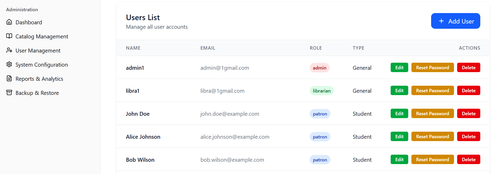
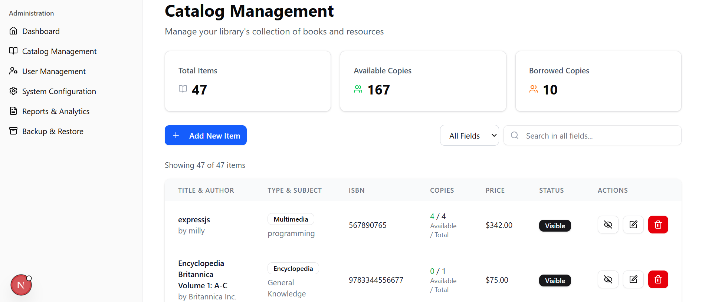
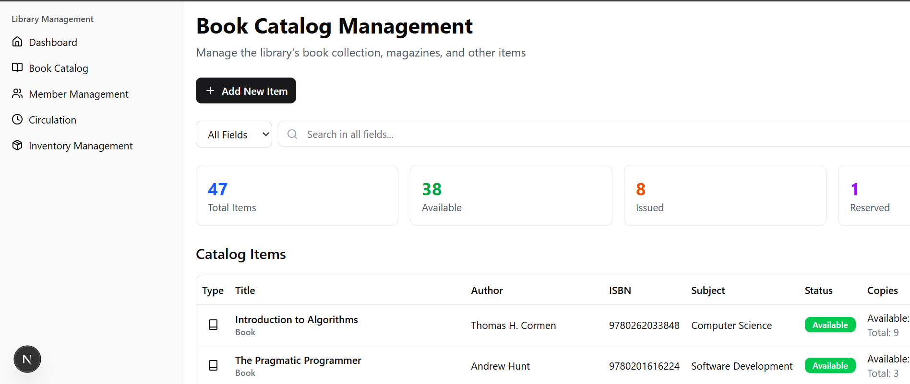
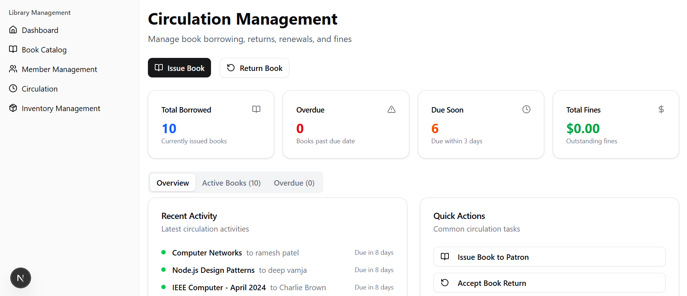
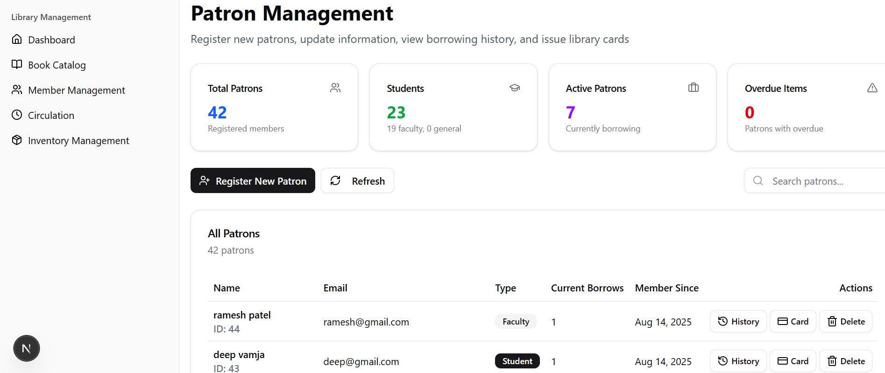
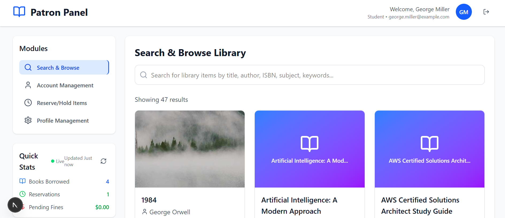
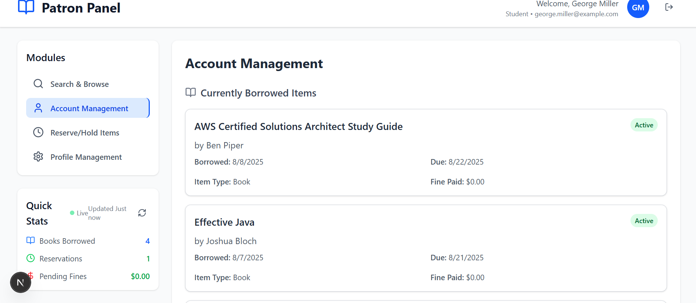

📚 Library Management System (LMS)

A next-gen Library Management System designed to automate and simplify library operations 🚀.
From cataloging & circulation to user management & analytics, this LMS empowers libraries with real-time visibility, role-based security, and an intuitive UI.

✨ Core Features

🔎 Smart Cataloging – Add, edit, search, and filter books, journals & multimedia

🔐 Role-Based Access – Secure login for Admin, Librarian, Patron

📚 Circulation Management – Issue, return, renew books + auto fine calculation

👥 Patron Dashboard – Borrowing history, reservations, overdue notifications

🔒 Industry-Grade Features → Role-based access, fine calculation, reporting & analytics, inventory control.

📊 Analytics & Reports – Popular books, overdue items, student activity

📦 Inventory Control – Track lost/damaged items & conduct audits

⚡ Modern UI/UX – Responsive, fast, and easy-to-use interface

🛠 Tech Stack

⚛️ React.js	Component-based UI

▲ Next.js	Full-stack framework (SSR & API routes)

🎨 TailwindCSS	Modern utility-first styling

🔗 Prisma ORM	Elegant database modeling & queries

🗄️ MySQL	Relational database for persistence

🛡️ JWT & RBAC	Secure authentication & role management

🌐 Git + GitHub	Version control & collaboration

🔒 User Roles

Admin 🛡️ → Manage users, roles, system configs, reports

👤 Admin User
  

### 📖 Book Catalog 
  

### 📊 Reports & Analytics
   

Librarian 📖 → Catalog books, issue/return, manage overdue, track inventory

📚 Library Book
  

🔄 Library Circulation
  

🧑‍🎓 Library Patron
  

Patron 👤 → Search, reserve, borrow books, view history, manage profile

### 👤 Patron Profile  
 

🧑‍🎓 Patron Account Management
 

⏳ Advanced analytics & SMS/email notifications (planned)

We 💙 contributions!

Fork the repo

Create a branch (feature/xyz)

Commit & push

Open a PR 🚀

If you found this project helpful, don’t forget to Star ⭐ the repo and share it with others!
